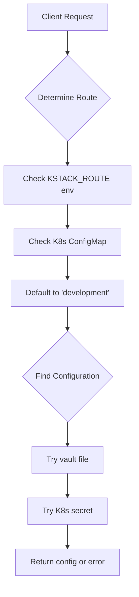

# Configuration Discovery

How kstack-lib discovers and loads configuration for Layer 3 services.

## Overview

Configuration discovery follows a hierarchical approach:

1. Determine active route
2. Read configuration from available sources
3. Return configured client

## Route Discovery

The active route is determined from these sources (in order):

### 1. Environment Variable (Highest Priority)

```bash
export KSTACK_ROUTE=development
```

### 2. Kubernetes ConfigMap

```yaml
apiVersion: v1
kind: ConfigMap
metadata:
  name: kstack-route
  namespace: layer-3-cloud
data:
  active-route: development
```

Accessed via:
```bash
kubectl get configmap kstack-route -n layer-3-cloud \
  -o jsonpath='{.data.active-route}'
```

### 3. Default Value

If neither source is available, defaults to `development`.

## Configuration Sources

Once the route is determined, configuration is loaded from:

### Local Development - Vault Files

**Location**: `~/github/devops/partsnap-kstack/vault/dev/`

**Redis Configuration**:
```yaml
# redis-cloud.yaml
development:
  part-raw:
    host: redis-development-raw.layer-3-cloud
    port: 6379
    username: default
    password: partsnap-dev
  part-audit:
    host: redis-development-audit.layer-3-cloud
    port: 6379
    username: default
    password: partsnap-dev

testing:
  part-raw:
    host: redis-testing-raw.layer-3-cloud
    port: 6379
    username: default
    password: partsnap-test
```

**LocalStack Configuration**:
```yaml
# localstack.yaml
development:
  endpoint_url: http://localhost:4566
  aws_access_key_id: test
  aws_secret_access_key: test
  region_name: us-west-2

testing:
  endpoint_url: http://localstack-testing.layer-3-cloud:4566
  aws_access_key_id: test
  aws_secret_access_key: test
  region_name: us-east-1
```

### Kubernetes Deployment - Secrets

**Redis Secret**:
```yaml
apiVersion: v1
kind: Secret
metadata:
  name: redis-credentials-development
  namespace: layer-3-cloud
type: Opaque
data:
  redis-host: <base64>
  redis-port: <base64>
  redis-username: <base64>
  redis-password: <base64>
  audit-redis-host: <base64>
  audit-redis-port: <base64>
  audit-redis-username: <base64>
  audit-redis-password: <base64>
```

**LocalStack Secret**:
```yaml
apiVersion: v1
kind: Secret
metadata:
  name: localstack-credentials-development
  namespace: layer-3-cloud
type: Opaque
data:
  endpoint-url: <base64>
  aws-access-key-id: <base64>
  aws-secret-access-key: <base64>
  region-name: <base64>
```

## Configuration Hierarchy



## Manual Configuration Access

You can access configuration directly:

```python
from kstack_lib import get_redis_config, get_localstack_config

# Get Redis config for active route
redis_config = get_redis_config(database='part-raw')
# Returns: {"host": "...", "port": 6379, "username": "...", "password": "..."}

# Get LocalStack config for active route
localstack_config = get_localstack_config()
# Returns: {"endpoint_url": "...", "aws_access_key_id": "...", ...}

# Get config for specific route
test_config = get_redis_config(database='part-raw', route='testing')
```

## Error Handling

If configuration cannot be found:

```python
from kstack_lib import get_redis_config

try:
    config = get_redis_config(database='part-raw')
except ValueError as e:
    print(f"Configuration error: {e}")
    # Redis configuration not found for route 'development' database 'part-raw'
```

## Environment Setup

### Local Development

1. Clone partsnap-kstack repository:
   ```bash
   git clone https://github.com/partsnap/partsnap-kstack.git ~/github/devops/partsnap-kstack
   ```

2. Set route:
   ```bash
   export KSTACK_ROUTE=development
   ```

3. Vault files are read automatically from `~/github/devops/partsnap-kstack/vault/dev/`

### Kubernetes Deployment

1. Mount ConfigMap in deployment:
   ```yaml
   envFrom:
   - configMapRef:
       name: kstack-route
       namespace: layer-3-cloud
   ```

2. Secrets are read automatically by kstack-lib from `layer-3-cloud` namespace

## Best Practices

1. **Never hardcode credentials** - Always use vault files or K8s secrets
2. **Use environment variables for route** in local development
3. **Keep vault files in .gitignore** (they're already excluded)
4. **Rotate secrets regularly** in production
5. **Use separate routes** for different environments (dev, test, staging, prod)
